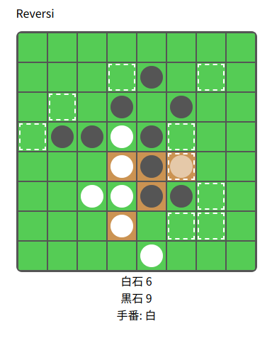
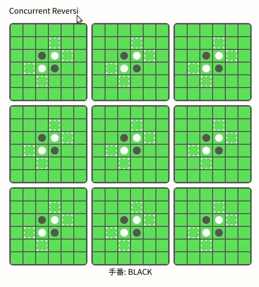

# Reversi

ブラウザ上で遊べるリバーシです。(手動操作のみ。)

- [普通のリバーシ](https://vain0x.github.io/reversi/)
- [並行リバーシ](https://vain0x.github.io/reversi/concurrent/)
    - 6x6 リバーシの結果で三目並べをする

## 普通のリバーシ

## 並行リバーシ

- ルール:
    - 黒が先手、白が後手
    - 1回の手番でいずれかのリバーシに1手指す
    - 決着のついたリバーシは、外側の三目並べのマスとして、その勝者の色の石になる
    - 外側の三目並べで、同じ色の石を3つ並べたら勝ち
